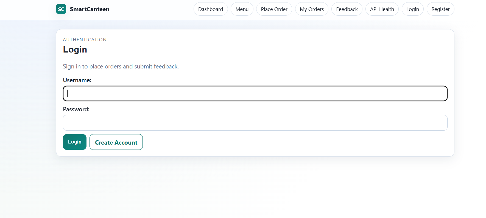
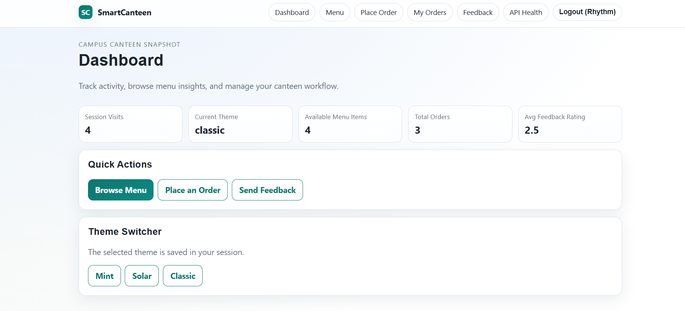
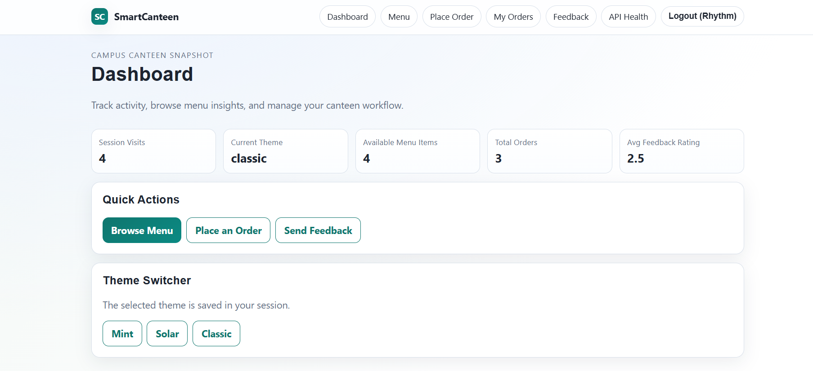
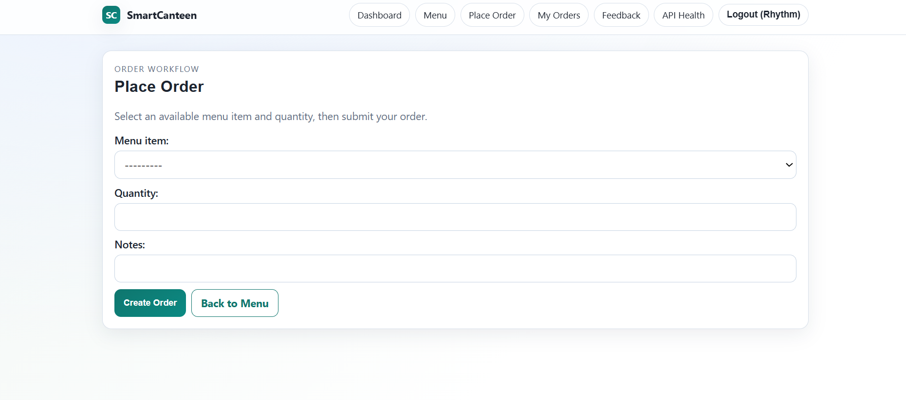
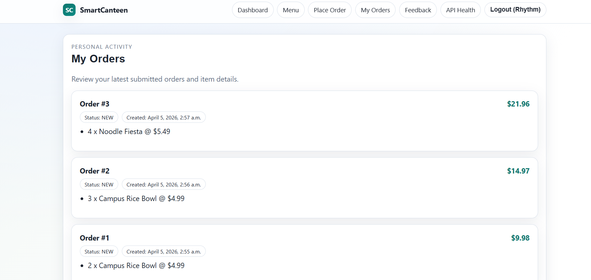
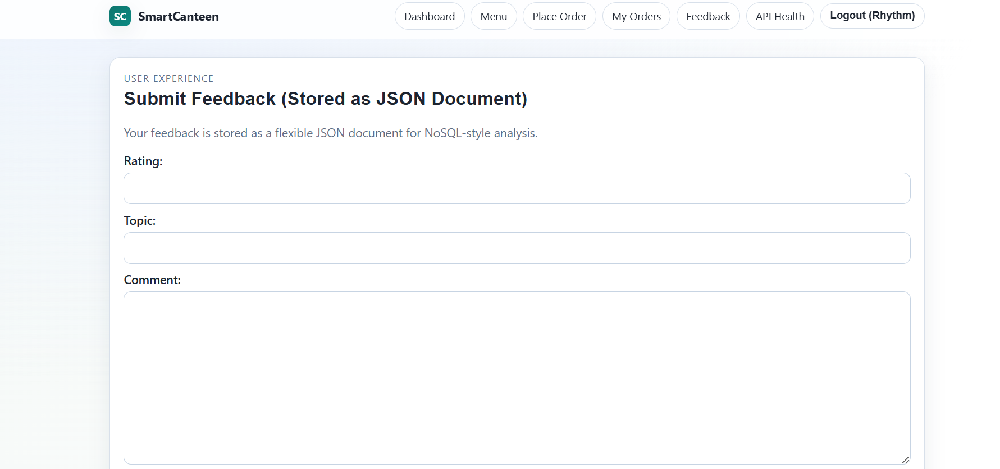

# SmartCanteen

SmartCanteen is a simple Django campus canteen web application created for a web development lab. It demonstrates the full Django workflow around request/response handling, forms, sessions, routing, templating, ORM-based CRUD, authentication, and custom middleware.

## Features

- Request and response examples with HTML, JSON, and redirect responses
- User registration, login, logout, and session-based theme tracking
- Menu browsing and staff-only CRUD for menu items
- Order placement with relational database models
- Feedback submission stored in a JSONField for document-style data handling
- Custom middleware for request logging, security headers, and error handling
- Responsive UI with shared templates and static CSS

## Tech Stack

- Python 3.13
- Django 6.0.3
- SQLite

## Project Structure

- `smartcanteen/` - project settings and root URL configuration
- `core/` - main app with models, views, forms, middleware, and migrations
- `templates/` - shared and app templates
- `static/` - CSS and other static assets
- `LAB_REPORT.md` - full lab report in standard format

## Setup

```bash
python -m pip install -r requirements.txt
python manage.py migrate
python manage.py createsuperuser
python manage.py runserver
```

Open the app at:

```text
http://127.0.0.1:8000/
```

## Demo Account Notes

- Staff users can create, edit, and delete menu items.
- Regular users can register, place orders, and submit feedback.
- Demo menu items are seeded automatically through migrations.

## Demo of Project






## Lab Report


See [LAB_REPORT.md](LAB_REPORT.md) for the full standard lab report, including the project description, MVT architecture, and major code components.
